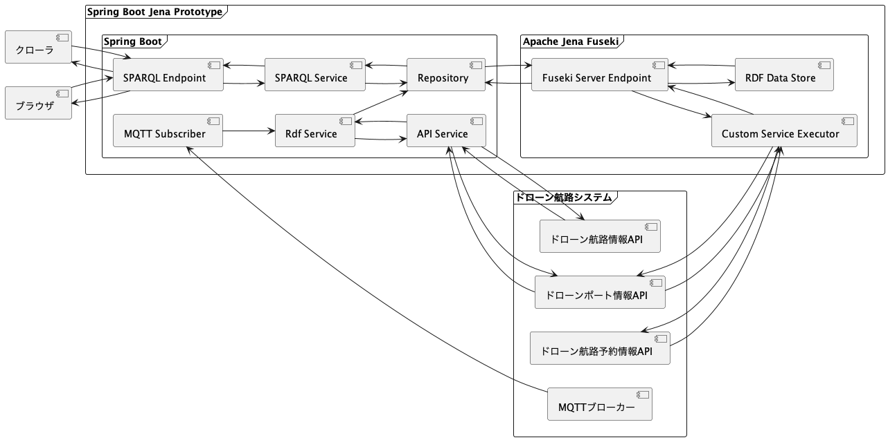
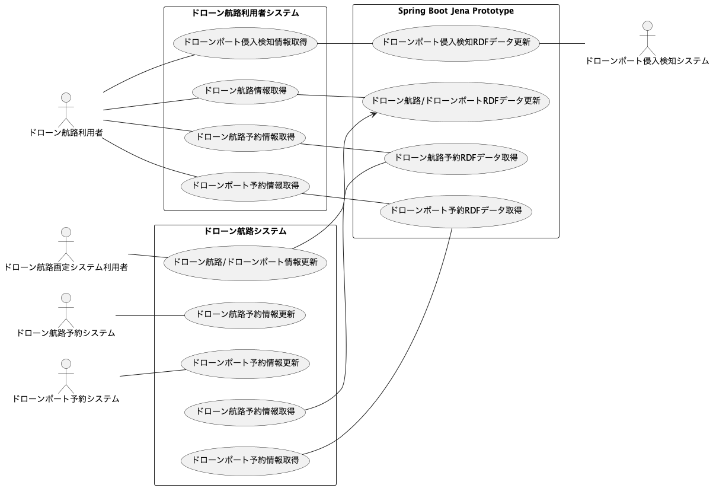
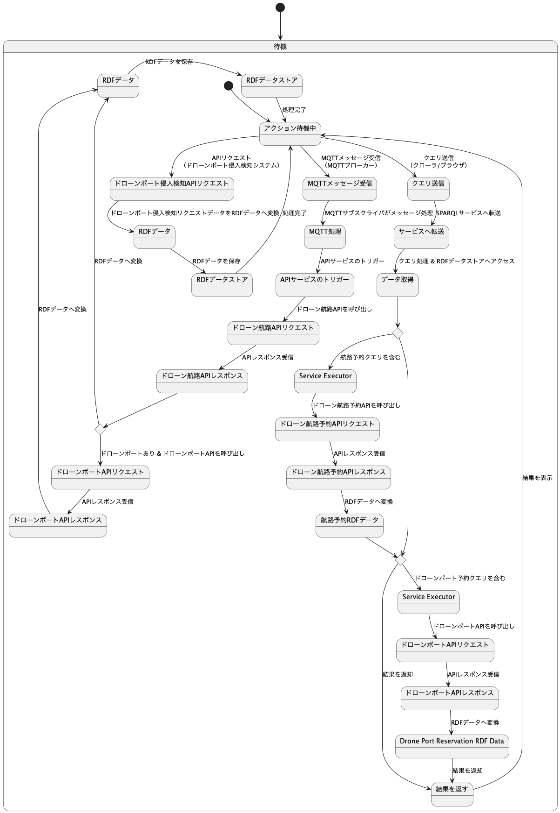

# SPARQLサービス

このリポジトリは、ドローン航路のあり方に係る調査・研究として、ドローン航路システムが持つデータをRDF化してセマンティクスに管理し、SPARQL検索を提供するサービスのサンプルを公開しています。

## 目次

- [システム概要](#システム概要)
- [構築と設定](#構築と設定)
- [起動方法](#起動方法)
- [使用方法](#使用方法)
- [ライセンス](#ライセンス)
- [免責事項](#免責事項)

## システム概要

このアプリケーションは、ローカルのApache Jena Fusekiエンドポイントに対してSPARQLクエリを実行するためのREST APIを提供します。更新時に通知を受け取るためのMQTT統合機能を備えており、外部システムAPIからデータを取得してRDFモデルに変換します。また、特定のSERVICE句を使用してSPARQLクエリを実行することで予約情報を動的に取得し、クエリ結果を返します。

### システム構成


### ユースケース図


### 状態遷移図


### コンポーネント

- **Spring Boot**: SPARQLクエリを処理し、外部システムからのレスポンスをRDFモデルに変換します。
- **Apache Jena Fuseki**: ローカルSPARQLエンドポイントとストレージとして機能します。
- **Fuseki Extension**: Apache Jena Fusekiにカスタムロジックを追加します。

## 構築と設定

### ポート一覧

| サービス                | ポート  |
|-----------------------|-------|
| Spring Boot API       | 8080  |
| Apache Jena Fuseki    | 3030  |

### 設定ファイル一覧

アプリケーションの設定を行うファイルは以下になります:
- `.env`
- `.env.shared`
- [`.env.fuseki`](.env.fuseki)
- [`spring boot application.yml`](backend/src/main/resources/application.yml)
- [`fuseki extension application.properties`](fuseki/fuseki-extension/src/main/resources/application.properties)
- [`log4j2.properties`](fuseki-config/log4j2.properties)
- [`docker-compose.yml`](docker-compose.yml)
- [`docker-compose.override.yml`](docker-compose.override.yml)（spring boot開発用）
- [`docker-compose.yml`](fuseki/fuseki-extension/docker-compose.yml)（fuseki extension開発用）

## 起動方法

### クイックスタート

1. 最初に`.env.template`を`.env`にファイル名を変更して値を入力し、`.env.shared.template`を`.env.shared`にファイル名を変更して値を選択します。このステップはDocker Composeコマンドを実行する前に実施してください。
2. **重要:** Docker Composeファイルを指定するために常に`-f`オプションを使用してください。
   Docker Composeを使用してアプリケーションをビルドして実行します:
   ```bash
   docker compose -f docker-compose.yml up --build -d
   ```
3. 各種インターフェースにアクセスします（ローカルで実行している場合）:
   - Spring Boot API:
      - Service Description : http://localhost:8080/api/v1/sparql
      - SPARQLクエリ : http://localhost:8080/api/v1/sparql/query
   - Fusekiインターフェース : http://localhost:3030/#/ (ログインユーザー名は**admin**、パスワードは`.env`で設定する必要があります)

## 使用方法

### APIの利用

POSTリクエストを使用してAPIエンドポイントにSPARQLクエリを送信します:
```bash
curl -X POST \
  http://localhost:8080/api/v1/sparql/query \
  -H 'Content-Type: text/plain' \
  -d 'SELECT * WHERE { ?s ?p ?o } LIMIT 10'
```

### OpenAPI仕様書へのアクセス

http://localhost:8080/swagger-ui/index.html へアクセスすることで、自動生成されたOpenAPI仕様書を閲覧することができます。

ただし、[DebugController](./backend/src/main/java/com/example/sparqlservice/controller/DebugController.java)などの一部のエンドポイントは、OpenAPI仕様書に含まれていません。

仕様書をダウンロードするには、以下のエンドポイントへアクセスしてください:
- http://localhost:8080/v3/api-docs
- http://localhost:8080/v3/api-docs.yaml

### Tips

### Fuseki管理者パスワードの変更

Fuseki管理者パスワードは、`/fuseki`ディレクトリが空のときにのみ生成されるため、最初にFusekiボリュームを削除する必要があります。

1. Fusekiコンテナが停止して削除されていることを確認します。
2. `docker volume rm spring-boot-jena-prototype_fuseki-data`を実行してボリュームを削除します。
3. `.env.template`を`.env`にリネームし、`FUSEKI_ADMIN_PASSWORD`に値を入力したことを確認します。
4. `docker compose up fuseki -d`でFusekiコンテナを再ビルドします。

### FusekiのJVMオプションの指定
必要に応じて、`.env`の`FUSEKI_JVM_ARGS`でJVMのオプションの値を指定できます。

### Fusekiのデフォルトデータセット
1. `.env.fuseki`にデフォルトで作成するdataset名を記述します。
2. `/fuseki/datasets/{dataset名}` 配下に`.ttl`ファイルを配置すると、コンテナ起動時に自動的にdatasetにデータがロードされます。

### 開発セットアップ

プロジェクトにはVS Code Dev Containersを使用した開発設定が含まれています。WSL2の使用が推奨されます。:

1. VS CodeとDev Containers拡張機能をインストールします
2. プロジェクトをVS Codeで開きます
3. **重要:** "Reopen in Container"をクリックする前に`docker compose up`を実行しないでください。
4. プロンプトが表示されたら、"Reopen in Container"をクリックします
5. fusekiなどの追加コンテナを実行する必要がある場合は、`docker compose up [YOUR_SERVICE]`を手動で実行します。**重要:** "app"サービスを指定しないでください。

**注:** 開発セットアップでは、環境が`developer`ユーザー（UIDとGIDが1000に設定）としてログインするように構成されています。

### データ永続化

Fusekiデータは`fuseki-data`という名前のDockerボリュームを使用して永続化されます。

### Fuseki Extension

`fuseki-extension`モジュールは、[カスタムサービスエグゼキュータ](https://jena.apache.org/documentation/query/custom_service_executors.html)とコンバータを統合することで、Apache Jena Fusekiの機能を向上させます。このエクステンションにより、アプリケーションは外部APIと連携し、そのレスポンスをRDFモデルに変換し、SPARQLを使用してクエリを実行できます。その結果、アプリケーションはSPARQLクエリ実行中に外部の予約情報APIにリクエストを送信し、結果をRDFデータとしてSPARQLクライアントに返されるクエリ結果に組み込むことができます。

Apache Jena Fusekiをカスタムモジュールで拡張する方法については、[Fusekiモジュールドキュメント](https://jena.apache.org/documentation/fuseki2/fuseki-modules.html)を参照してください。

### ポイント

- **カスタムイニシャライザ**: `CustomInitializer`クラスは、JenaSubsystemLifeCycleにカスタムサービスエグゼキュータを登録する役割を担っています。これにより、アプリケーションは特定のSERVICE URIを処理し、対応するロジックを実行できます。`META-INF/services/org.apache.jena.sys.JenaSubsystemLifecycle`ファイルに`CustomInitializer`の完全修飾クラス名（FQCN）を指定し、JARをビルドすることで、特定のディレクトリにこのJARを配置してFusekiの機能を拡張できます。
  - 参照: [`CustomInitializer`](./fuseki/fuseki-extension/src/main/java/com/example/CustomInitializer.java)
  - 参照: [`org.apache.jena.sys.JenaSubsystemLifecycle`](./fuseki/fuseki-extension/src/main/resources/META-INF/services/org.apache.jena.sys.JenaSubsystemLifecycle)
- **カスタムサービスエグゼキュータ**: このFuseki Extensionには、特定のURIを持つSERVICE句を含むSPARQLクエリを処理するためのサービスエグゼキュータが含まれています:
    - 参照: [`AirwayReservationServiceExecutor`](./fuseki/fuseki-extension/src/main/java/com/example/service_executor/AirwayReservationServiceExecutor.java)
    - 参照: [`DronePortReservationServiceExecutor`](./fuseki/fuseki-extension/src/main/java/com/example/service_executor/DronePortReservationServiceExecutor.java)

## ライセンス

- 本リポジトリはMITライセンスで提供されています。
- ソースコードおよび関連ドキュメントの著作権はIntentExchange株式会社に帰属します。

## 免責事項
- 本リポジトリの内容は予告なく変更・削除する可能性があります。
- 本リポジトリの利用により生じた損失及び損害等について、いかなる責任も負わないものとします。
